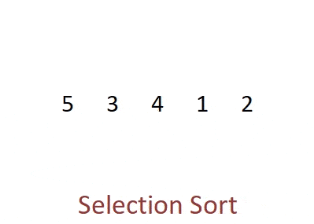

# Selection Sort

Selection sort is a simple sorting algorithm that divides the list to be sorted into two parts, a sorted and an unsorted part, with the sorted side initially empty. The algorithm involves going through the unsorted part repeatedly, each time transferring either the smallest or largest element from the unsorted to the sorted part until no elements are left in the unsorted part. For sorting in ascending order, it is the smallest element that is transferred, and the largest element for sorting in descending order.

